## Overview

In this section, we will guide you through the process of creating a new diagram on Visual Paradigm Online with options to create or not create an account. Both options have the ability to save diagrams on Visual Paradigm Online, though creating an account allows you to work on your diagrams across different devices. We suggest creating an account to safely store your diagrams without the risk of losing unsaved diagrams.

1. **Go** to the Visual Paradigm Online website.

    !!! danger

        The website’s URL is [https://online.visual-paradigm.com](https://online.visual-paradigm.com) and displays the “Get started for Free” button on the front page. You do *not* have to download any files or programs for this guide.

    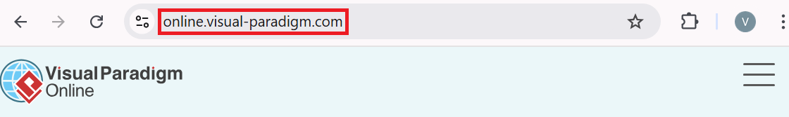

2. **Click** on the "Get started for Free" button.

    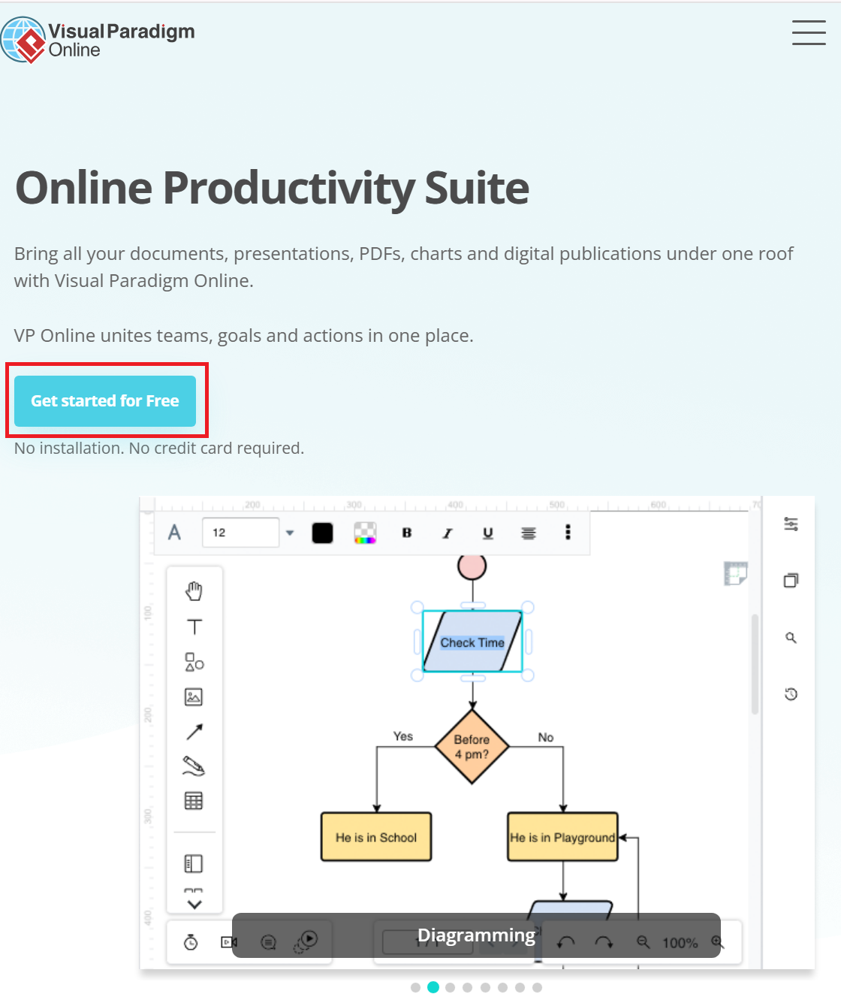

    Upon clicking the button, you will be redirectd to the Home page inside Visual Paradigm Online.

    If you want to create an account on Visual Paradigm Online, follow the steps from Option 1 *in addition* to the steps in Option 2.
    If you do not want to create an account on Visual Paradigm Online, follow the steps starting from Option 2.

## Option 1: With creating an account

1. **Click** on the profile icon on the top right corner of the page.

2. **Click** on "Sign Up" from the dropdown menu.

    !!! info
        If you already have an account on Visual Paradigm Online, you may click on "Log in" and follow the steps provided on the website.

    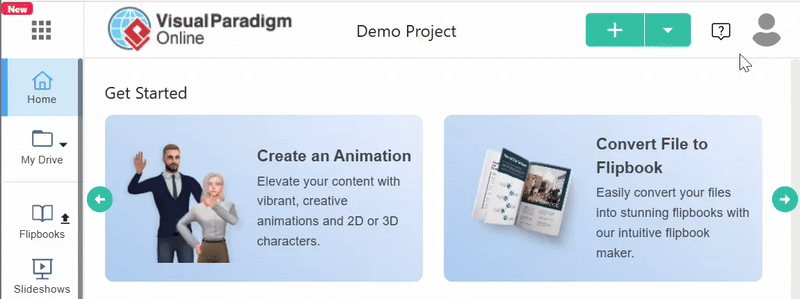

3. **Enter** your email address, preferably your post-secondary institution's email address if you are currently enrolled in a post-secondary institution.

    Keep the default choice for the Edition, which should have the blue circle next to "Use the Free Edition" option. 

    !!! warning
        If you see the blue circle next to the "Enjoy 30-Day trial of the Combo Edition", **choose** the "Use the Free Edition" option.

    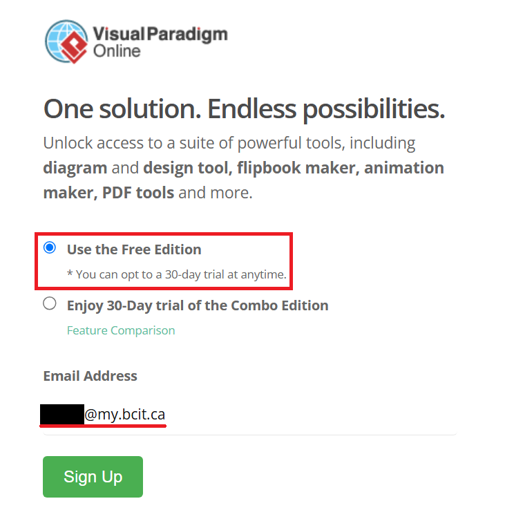

4. **Click** on the "Sign Up" button.

    !!! info
        You may have to complete a simple human verification test to prove Visual Paradigm Online that you are a human user.

    !!! success
        You will be redirected to this page prompting you to **check** your email account and **click** on the link from Visual Paradigm Online.

        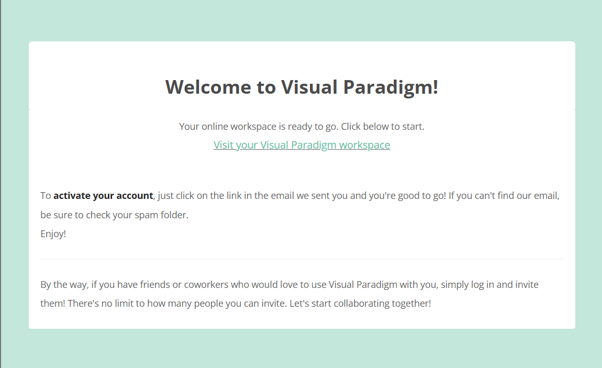

5. **Go** to your email account that you entered on Visual Paradigm and **click** on the "Activate your Visual Paradigm online account" link.

    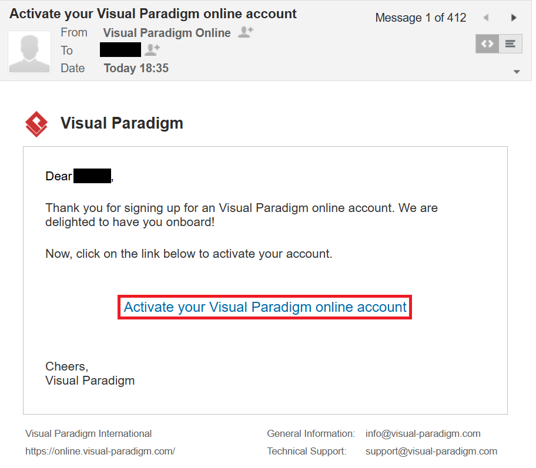

    You will be redirected to a new page after clicking the email's link, which is shown in Step 6.

6. **Enter** your password to activate your Visual Paradigm account.

    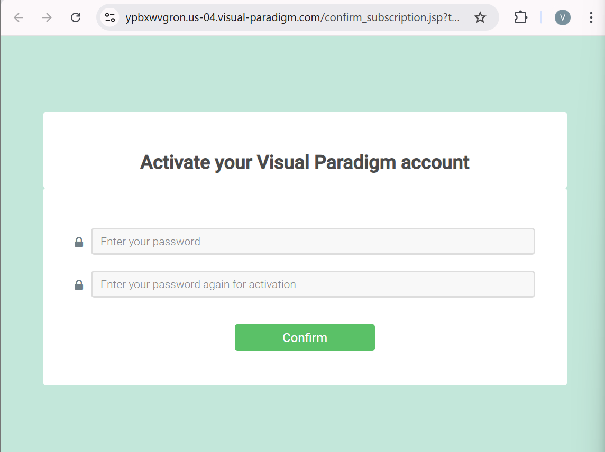

    !!! note
        Make sure to remember the password that you set for your Visual Paradigm Online account!

7. **Click** on the Confirm button.

    !!! success
        You will see this page that confirms your account has been activated.

        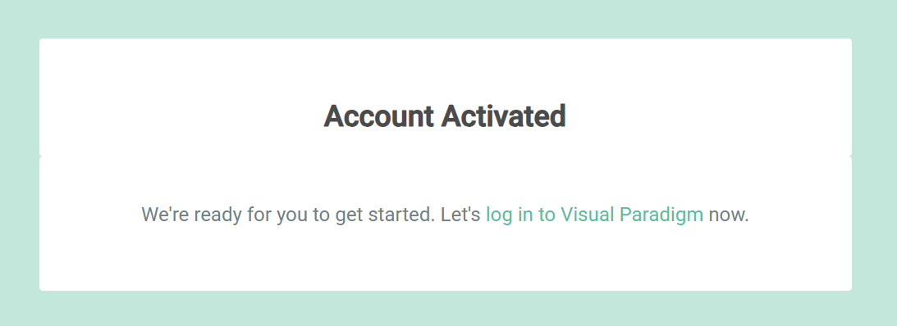

8. **Click** on the "log in to Visual Paradigm" link.

    You will be redirected to the login page and be asked to **enter** your email address and password.

    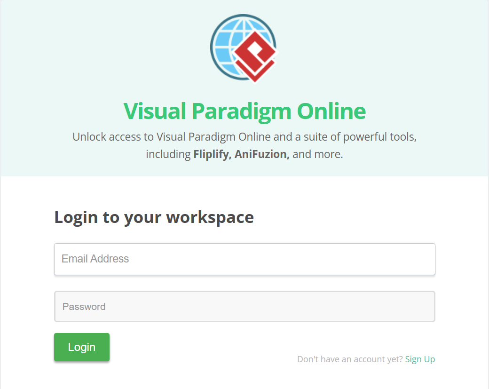

    You will be redirected back to the home page of Visual Paradigm Online.

## Option 2: Without creating an account (or continuing the steps if you started from Option 1)

1. **Click** on Diagram, which can be found in the horizontal bar on the left side.

    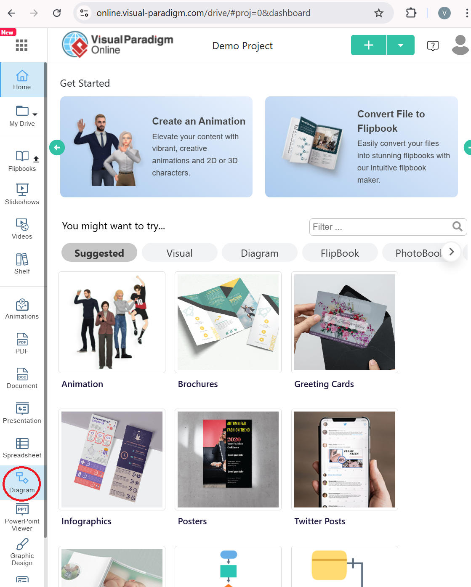

2. **Click** on the + CREATE button.

    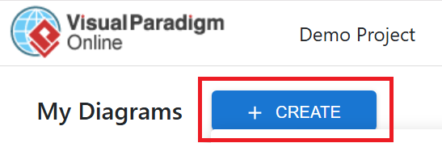

    !!! success 

        A dropdown menu will appear below the + CREATE button

        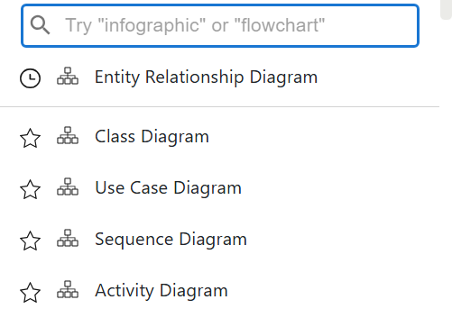

3. **Click** on a diagram from the dropdown menu.

    !!! note
        You can use the search bar and find a specific diagram to create or scroll through the dropdown menu to explore all available diagrams.

    !!! example
        In this guide, we will click on Entity Relationship Diagram.

    After clicking on a diagram from the dropdown menu, you will be redirected to a blank template.

    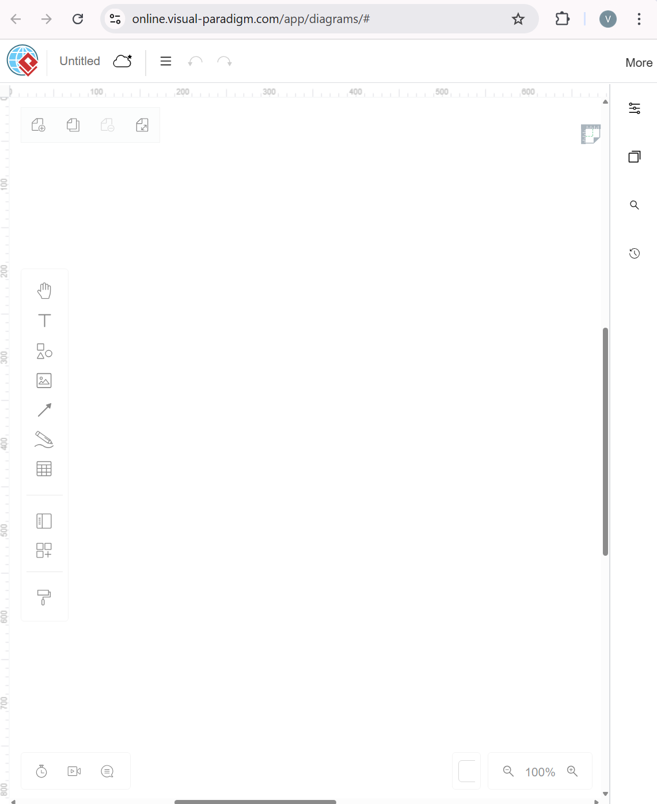

    Now that you have a blank template, this guide will show you [how to add shapes and lines to make a new diagram](https://vik061.github.io/Visual-Paradigm-User-Documentation/Creating_shapes_and_lines/).