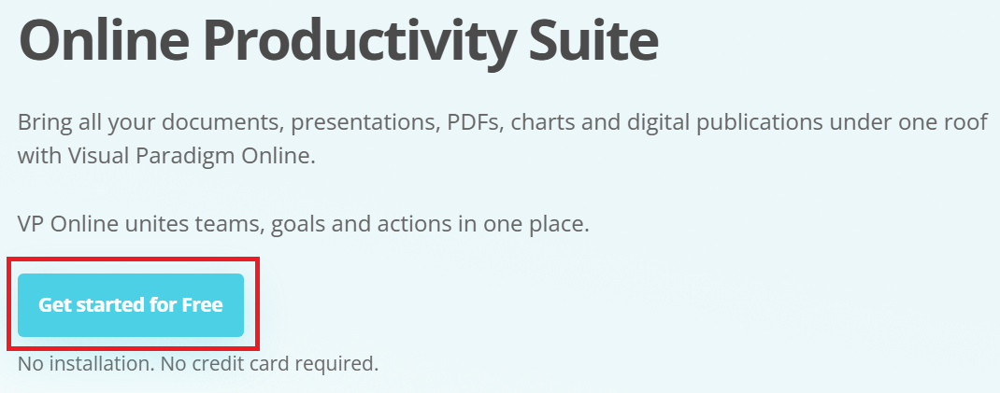

## Overview

Whether you would like to create or not create an account on Visual Paradigm, this section will show the steps to create a new diagram for free.

1. **Go** to the Visual Paradigm Online website.

!!! warning

    The website’s URL is https://online.visual-paradigm.com/ and displays the “Get started for Free” button on the front page. You do not have to download any files or programs for this guide.

2. **Click** on the "Get started for Free" button.

Upon clicking the button, you will be redirectd to the Home page inside Visual Paradigm Online.

## Option 1: Without creating an account

3. **Click** on Diagram, which can be found in the horizontal bar on the left side.

4. **Click** on the + CREATE button.

!!! success 

    A dropdown menu will appear below the + CREATE button

5. **Click** on a diagram from the dropdown menu.

!!! info
    You can use the search bar and find a specific diagram to create or scroll through the dropdown menu to explore all available diagrams.

!!! info
    In this guide, we will click on Entity Relationship Diagram.

After clicking on a diagram from the dropdown menu, you will be redirected to a blank template.

<!-- add blank template untitled without the red circle  -->

## Option 2: With creating a account