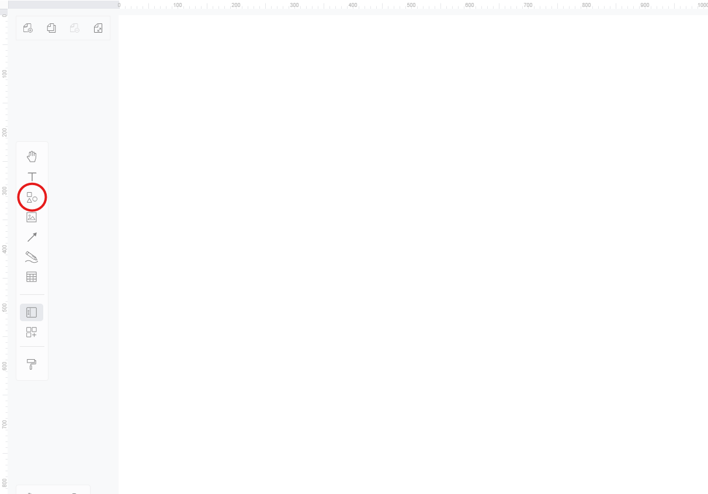
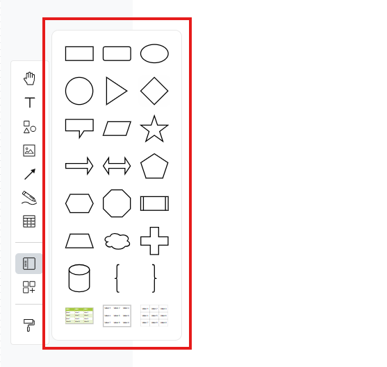
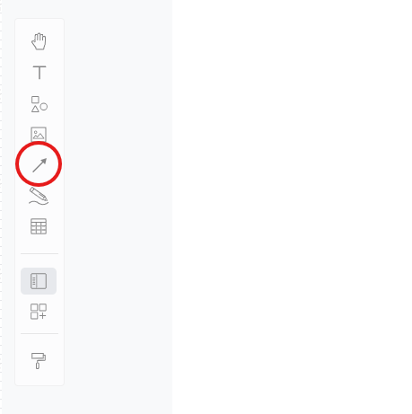
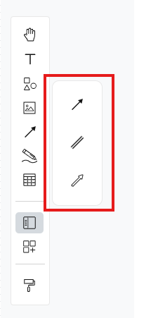
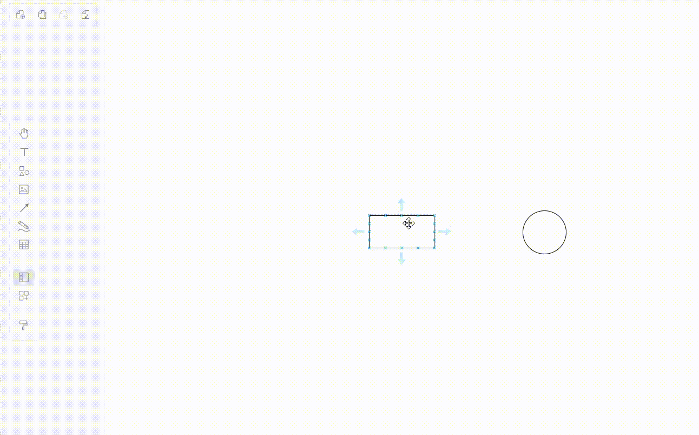

## Overview

In this section, we will guide you through the process of adding shapes and lines to your diagram in Visual Paradigm Online. This guide assumes you are already on a blank diagram page, ready to create your visual representation.

## Adding Shapes

1. **Click** on the "Shapes" icon located on the left toolbar.

    

    This icon opens a menu containing various shapes that you can use in your diagram, allowing for a diverse range of visual elements.

2. **Select** a shape from the menu.
 
    !!! tip
        Explore different shapes to find the ones that best fit your diagram needs. Common shapes include rectangles for processes, circles for events, and arrows for directional flow, each serving distinct purposes in your diagram.

    

3. **Drag** the selected shape onto the canvas.

    !!! info
        You can reposition the shape by clicking and dragging it to your desired location on the canvas. This flexibility allows you to arrange your diagram intuitively, ensuring a logical flow of information.

    

4. **Customize** the shape using the menu at the top to change its color, size, and style.

    !!! note
        Use the top menu to adjust the color and style of your shapes. Customizing shapes not only enhances visual appeal but also helps differentiate between various elements, making your diagram easier to interpret.

## Connecting Shapes with Lines

1. **Click** on the "Line" tool from the left toolbar.

    

    This tool allows you to create connections between different shapes, illustrating relationships or flows in your diagram, which is essential for conveying complex information clearly.

2. **Select** a type of line from the options that appear.

    

    You can choose from various line styles.

3. **Option 1**: **Click** and **drag** from the "Line" tool to manually create a connection between two shapes.

    - **Drag** the line from the toolbar and position it between the two shapes.
    - **Adjust** the endpoints of the line by dragging them to connect to the desired shapes.

        !!! success
            A line will appear connecting the two shapes, indicating a successful connection. This method is ideal for quickly linking shapes together, enhancing the flow of your diagram.

4. **Option 2**: **Click** on an existing shape on the canvas. A set of arrows will automatically appear around the shape. **Click** on these arrows to easily connect shapes.

    !!! info
        This method provides a quick way to establish connections without needing to select the line tool each time, streamlining your workflow. Simply **click** on the arrows to create connections between shapes effortlessly.

    

5. **Customize** the line using the menu at the top to change its appearance.

    !!! tip
        Use the top menu to adjust the style, thickness, and direction of your lines. Customizing lines can enhance the clarity of your diagram and help convey the intended message more effectively, ensuring that your audience understands the relationships between elements.

Now that you have added shapes and lines, you can proceed to customize them further or continue building your diagram. For instructions on how to save your work, this guide will show you the steps to [download a PDF of your diagram](https://vik061.github.io/Visual-Paradigm-User-Documentation/Downloading_PDF_of_diagram/).
