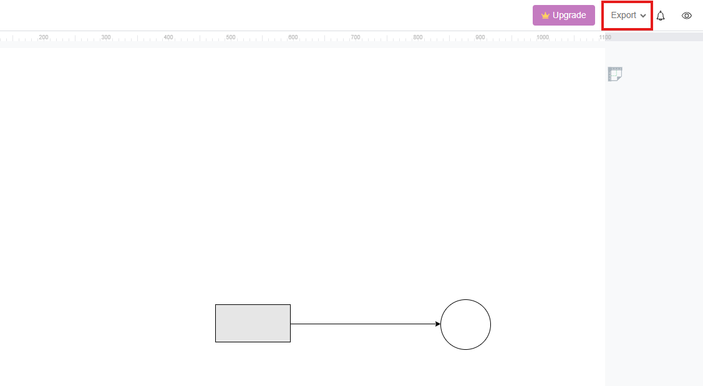
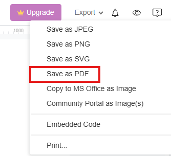
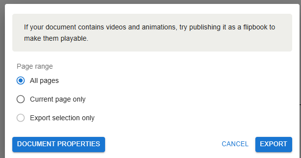
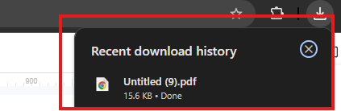

## Overview

In this section, we will guide you through the process of downloading your completed diagram as a PDF in Visual Paradigm Online. This feature allows you to save a professional-looking copy of your work for sharing or printing.

## Steps to Download

1. **Click** on the "Export" button located in the top menu.

      

      This button initiates the export process, allowing you to choose the format for your download.

2. **Select** "Save as PDF" from the dropdown menu.

      

      By selecting PDF, you ensure that your diagram retains its formatting and layout when shared or printed.

3. **Choose** your desired settings for the PDF export.

    !!! info
        You will see a dialog box asking which part of the page you would like to export. You can choose to export all pages, the current page only, or a specific selection.

      

4. **Click** on the "Export" button to download the PDF.

    !!! success
        Your diagram will be downloaded as a PDF file to your device. This file can now be shared with others or printed for physical use.

      

5. **Verify the Download**: Once the download is complete, locate the PDF file on your device and open it to ensure everything appears correctly.

   

!!! note
    If you encounter any issues with the download or the appearance of the PDF, double-check your export settings and try the process again.

By following these steps, you can easily save a professional-looking PDF copy of your diagram. This feature is essential for sharing your work with others or for including it in reports and presentations.
